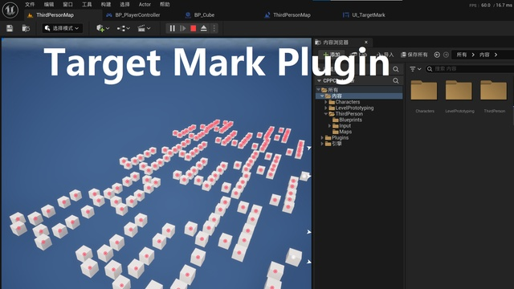
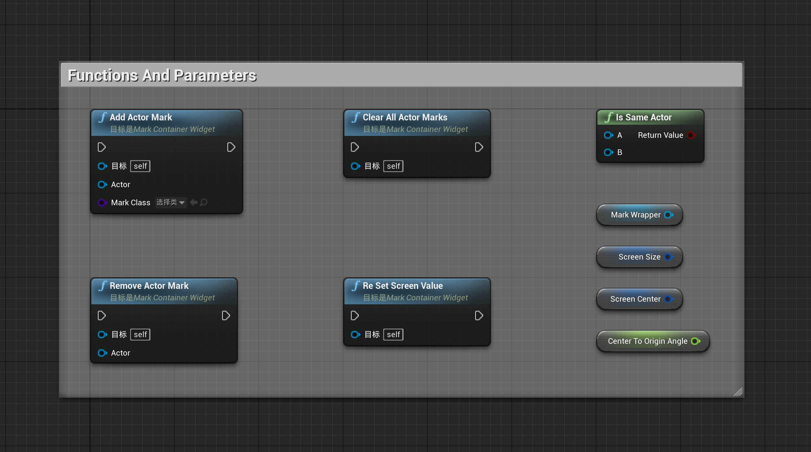

# TargetMarkPlugin
This is an efficient target tagging plugin that maintains a good frame rate even when there are a lot of tags.

Marketplace: [Link](https://www.fab.com/listings/c5bd807d-ad51-4e91-bb6a-5399a702f638)

  
## Overview.
What does our TargetMarkPlugin?

This is an efficient target tagging plugin that maintains a good frame rate even when there are a lot of tags.

1. Activation plugin.

2. You can see pre created assets in this directory

3. Next Step. you need to add Widget "UI_MarkContainer " to the Player Screen in the PlayerController.

**Note:** that OwnerPlayer needs to be set, otherwise Mark will not be displayed on the screen.

4. Add the Component 'TargetActorMarkComponent' to the Actor you created,And add it to the scene.

5. Select the 'Target Actor Mark' Component and choose the Mark icon you want in the MarkClass property.

6. Run the game and you will see the Actor marked on the screen. It's as simple as that.

## Customize

### You can design your own pattern to replace the pre provided pattern

## Function 
You can also manually Add or Remove actors that require Mark

1. Add Actor Mark
2. Remove Actor Mark
3. Clear All Actor Marks

 

**Number of Blueprints**: 3 Widget

**Code Modules**: TargetMarkPlugin (Runtime)

**Number of C++ Classes**: 5 Class

**Network Replicated**: No

**Supported Development Platforms**: Windows

**Supported Target Build Platforms**: Win64, Win32, Linux, Mac, IOS, Android
